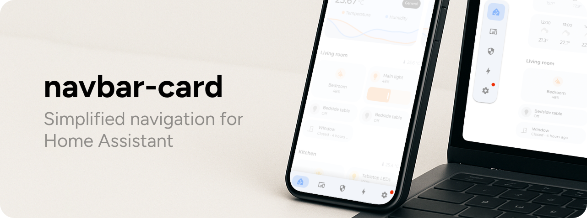

# Welcome

<figure><figcaption></figcaption></figure>

**Navbar Card** is a custom Lovelace card for Home Assistant that simplifies dashboard navigation. Inspired by the excellent [Adaptive Mushroom](https://github.com/piitaya/lovelace-mushroom) card and Google’s Material Design, it provides a clean, responsive navigation experience across devices.

* **Mobile:** Displays as a sleek, full-width bar at the bottom of the screen.
* **Desktop:** Adapts into a flexible container that can be placed on any side of the screen (top, bottom, left, or right), automatically adjusting its orientation for a seamless layout.

### Jump right in

<table data-view="cards"><thead><tr><th></th><th></th><th></th><th data-hidden data-card-cover data-type="files"></th><th data-hidden></th><th data-hidden data-card-target data-type="content-ref"></th></tr></thead><tbody><tr><td><h4><i class="fa-rocket-launch">:rocket-launch:</i></h4></td><td><strong>Installation</strong></td><td>Get your navbar up and running</td><td></td><td></td><td><a href="getting-started/installation.md">installation.md</a></td></tr><tr><td><h4><i class="fa-wrench">:wrench:</i></h4></td><td><strong>Configuration</strong></td><td>See how you can configure your personal experience</td><td></td><td></td><td><a href="broken-reference">Broken link</a></td></tr><tr><td><h4><i class="fa-vial">:vial:</i></h4></td><td><strong>Examples</strong></td><td>Take a look at some examples to bootstrap your navbar!</td><td></td><td></td><td><a href="broken-reference">Broken link</a></td></tr></tbody></table>

***

### Have some questions?

Need help using `navbar-card`, have ideas, or found a bug? Here's how you can reach out:

* **🐛 Found a bug or have a feature request?**\
  [Open an issue on GitHub](https://github.com/joseluis9595/lovelace-navbar-card/issues) so we can track and fix it.
* **❓Got questions, Do you want to share feedback, or just chat?**\
  Either start [a discussion on GitHub](https://github.com/joseluis9595/lovelace-navbar-card/discussions) or join the conversation on the [Home Assistant Community Forum ](https://community.home-assistant.io/t/navbar-card-easily-navigate-through-dashboards/832917).

Your feedback helps make navbar-card better for everyone. Don’t hesitate to reach out!

### 🍻Want to support the project?

If you enjoy using `navbar-card` and want to support its continued development, consider buying me a coffee (or a beer 🍺), or becoming a GitHub Sponsor!

<a href="https://www.buymeacoffee.com/joseluis9595" class="button primary" data-icon="beer-mug">Buy me a beer</a>    <a href="https://github.com/sponsors/joseluis9595" class="button secondary" data-icon="github">Become a Github sponsor</a>
