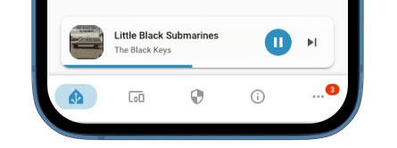

# Media Player


This feature is still in **BETA**. Some features might not work as expected



{% column width="58.333333333333336%" %}
When enabled, this configuration displays a `media_player` widget above the `navbar-card`. Currently, it is shown only in mobile mode and only when the `media_player` state is `paused` or `playing`.


{% column width="41.666666666666664%" %}
<figure><figcaption></figcaption></figure>



| Option                   |                               Type                               |                          Default                          | Description                                                                                    |
| ------------------------ | :--------------------------------------------------------------: | :-------------------------------------------------------: | ---------------------------------------------------------------------------------------------- |
| entity                   |          `string` \| [`JSTemplate`](../js-templates.md)          |                                                           | Entity ID of the media\_player                                                                 |
| show                     |          `boolean` \| [`JSTemplate`](../js-templates.md)         | `true` when media\_player is either `playing` or `paused` | Manually configure when the media player widget should be displayed                            |
| album\_cover\_background |                             `boolean`                            |                          `false`                          | Enable this option to display the album cover as blurred background of the media player widget |
| tap\_action              | [`HA Action`](https://www.home-assistant.io/dashboards/actions/) |                                                           | Home Assistant tap action configuration.                                                       |
| hold\_action             | [`HA Action`](https://www.home-assistant.io/dashboards/actions/) |                                                           | Home Assistant hold action configuration.                                                      |
| double\_tap\_action      | [`HA Action`](https://www.home-assistant.io/dashboards/actions/) |                                                           | Home Assistant double\_tap action configuration.                                               |
|                          |                                                                  |                                                           |                                                                                                |
